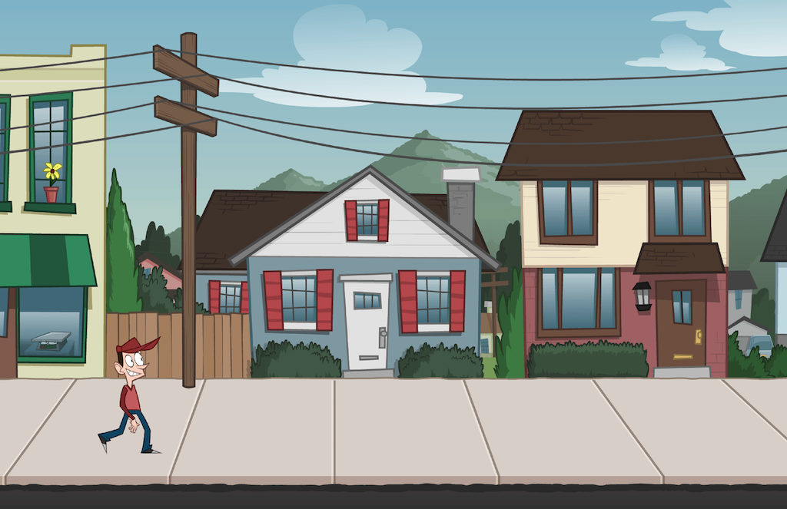

# Using sprite sheets in GameMaker

A simple project showing how to use sprite sheets with GameMaker.

A complete tutorial is available here:
[How to use sprite sheets with GameMaker](https://www.codeandweb.com/texturepacker/tutorials/how-to-use-sprite-sheets-with-gamemaker)

## Tutorial Content

* How to pack sprite strips and grids with TexturePacker
* Import these strips/grids into GameMaker Studio
* Tightly pack sprite sheets with TexturePacker
* Load tightly packed texture + data files in GameMaker

